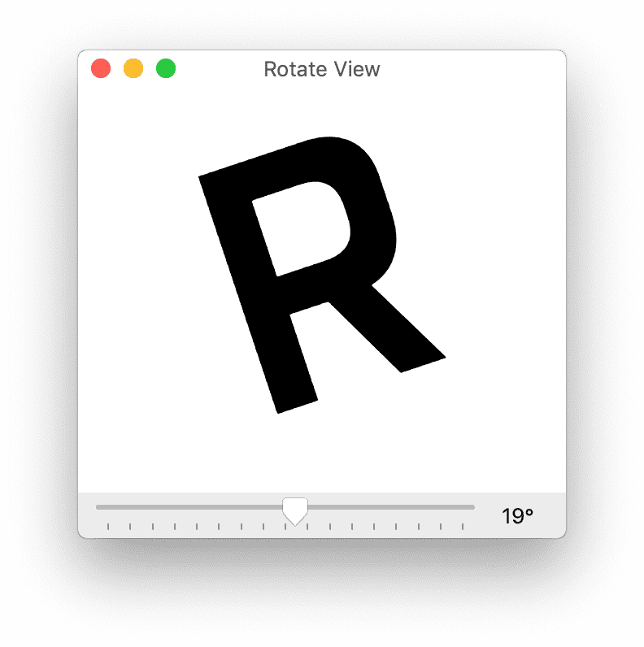

# Rotate View
[Glyphs font editor](http://glyphsapp.com/) plugin that allows one to rotate a glyph and view it from different angles. This plugin was inspired by an experience in punchcutting and appreciating the ability to rotate a Glyph and look at curves from all angles. 

Code is written by Aaron Bell

# Usage

* Open the *Rotate View* plugin from the *Window* menu. 
* It will automatically display the currently selected glyph. 
* Use the slider to rotate the glyph in the view clockwise and counter-clockwise.
* The window can be resized and the glyph will resize. 

# Installation

Install by clicking its *Install* button in *Window > Plugin Manager > Plugins* (Glyphs 3) or *Window > Plugin Manager* (Glyphs 2). Restart Glyphs once.

👉 Rotate View depends on the *Vanilla* module. Please install it via *Window > Plugin Manager > Modules* (Glyphs 3) or *Glyphs > Preferences > Addons > Modules* (Glyphs 2).

# Requirements

Tested on Glyphs 2.4.1 under OSX El Capitan. The script may not work under an older version of Glyphs or OS.

# License

Copyright 2017 Aaron Bell ([@aaronbell](http://twitter.com/aaronbell) & [@sajatype](http://twitter.com/sajatype)). Special thanks to Mark Frömberg's Kernkraft plugin that explained how to draw outlines in Vanilla and to Georg / Rainier who helped explain Glyphsapp callbacks. Also thanks to @jenskutilek for catching a crash case. 

Licensed under the [Apache License](http://www.apache.org/licenses/LICENSE-2.0), Version 2.0 (the "License"); you may not use this file except in compliance with the License.

See the License file included in this repository for further details.
